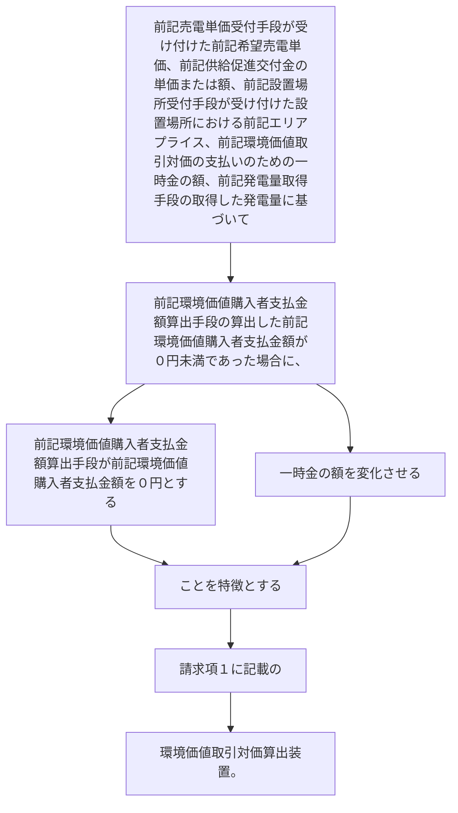

```mermaid
flowchart TD
A[前記売電単価受付手段が受け付けた前記希望売電単価、前記供給促進交付金の単価または額、前記設置場所受付手段が受け付けた設置場所における前記エリアプライス、前記環境価値取引対価の支払いのための一時金の額、前記発電量取得手段の取得した発電量に基づいて]
B[前記環境価値購入者支払金額算出手段の算出した前記環境価値購入者支払金額が０円未満であった場合に、]
C[前記環境価値購入者支払金額算出手段が前記環境価値購入者支払金額を０円とする]
D[一時金の額を変化させる]
E[ことを特徴とする]
F[請求項１に記載の]
G[環境価値取引対価算出装置。]
A --> B
B --> C
B --> D
C --> E
D --> E
E --> F
F --> G
```