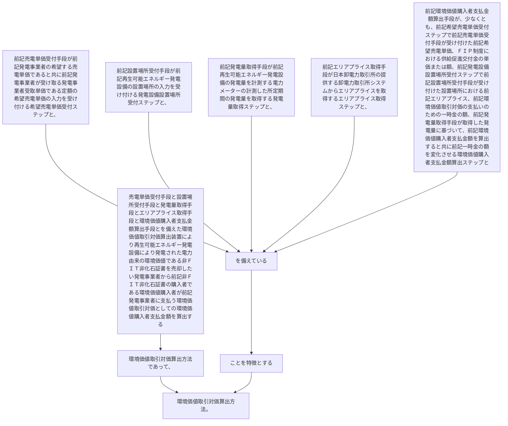

```mermaid
flowchart TD
A[売電単価受付手段と設置場所受付手段と発電量取得手段とエリアプライス取得手段と環境価値購入者支払金額算出手段とを備えた環境価値取引対価算出装置により再生可能エネルギー発電設備により発電された電力由来の環境価値である非ＦＩＴ非化石証書を売却したい発電事業者から前記非ＦＩＴ非化石証書の購入者である環境価値購入者が前記発電事業者に支払う環境価値取引対価としての環境価値購入者支払金額を算出する]
B[環境価値取引対価算出方法であって、]
C[前記売電単価受付手段が前記発電事業者の希望する売電単価であると共に前記発電事業者が受け取る発電事業者受取単価である定額の希望売電単価の入力を受け付ける希望売電単価受付ステップと、]
D[前記設置場所受付手段が前記再生可能エネルギー発電設備の設置場所の入力を受け付ける発電設備設置場所受付ステップと、]
E[前記発電量取得手段が前記再生可能エネルギー発電設備の発電量を計測する電力メーターの計測した所定期間の発電量を取得する発電量取得ステップと、]
F[前記エリアプライス取得手段が日本卸電力取引所の提供する卸電力取引所システムからエリアプライスを取得するエリアプライス取得ステップと、]
G[前記環境価値購入者支払金額算出手段が、少なくとも、前記希望売電単価受付ステップで前記売電単価受付手段が受け付けた前記希望売電単価、ＦＩＰ制度における供給促進交付金の単価または額、前記発電設備設置場所受付ステップで前記設置場所受付手段が受け付けた設置場所における前記エリアプライス、前記環境価値取引対価の支払いのための一時金の額、前記発電量取得手段が取得した発電量に基づいて、前記環境価値購入者支払金額を算出すると共に前記一時金の額を変化させる環境価値購入者支払金額算出ステップと]
H[を備えている]
I[ことを特徴とする]
J[環境価値取引対価算出方法。]
A --> B
B --> J
C --> H
D --> H
E --> H
F --> H
G --> H
H --> I
I --> J
```