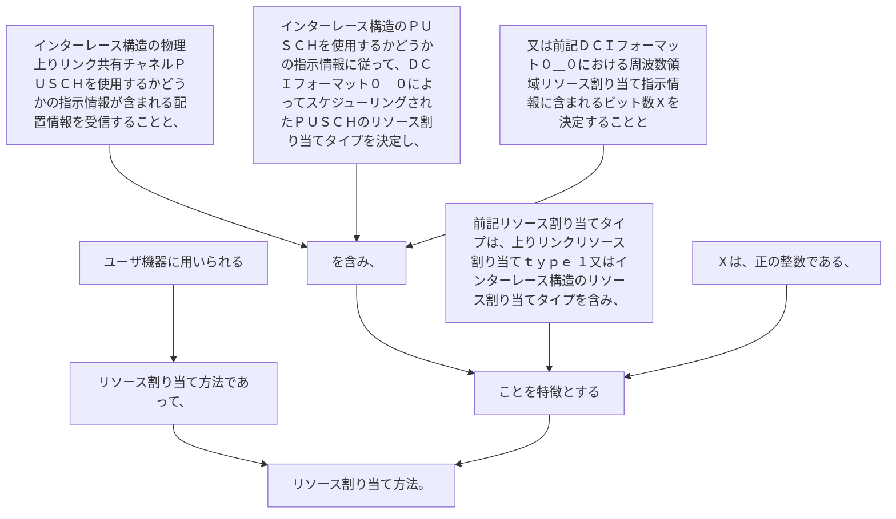

ユーザ機器に用いられるリソース割り当て方法であって、
インターレース構造の物理上りリンク共有チャネルＰＵＳＣＨを使用するかどうかの指示情報が含まれる配置情報を受信することと、
インターレース構造のＰＵＳＣＨを使用するかどうかの指示情報に従って、ＤＣＩフォーマット０＿０によってスケジューリングされたＰＵＳＣＨのリソース割り当てタイプを決定し、又は前記ＤＣＩフォーマット０＿０における周波数領域リソース割り当て指示情報に含まれるビット数Ｘを決定することとを含み、前記リソース割り当てタイプは、上りリンクリソース割り当てｔｙｐｅ  １又はインターレース構造のリソース割り当てタイプを含み、Ｘは、正の整数である、ことを特徴とするリソース割り当て方法。
