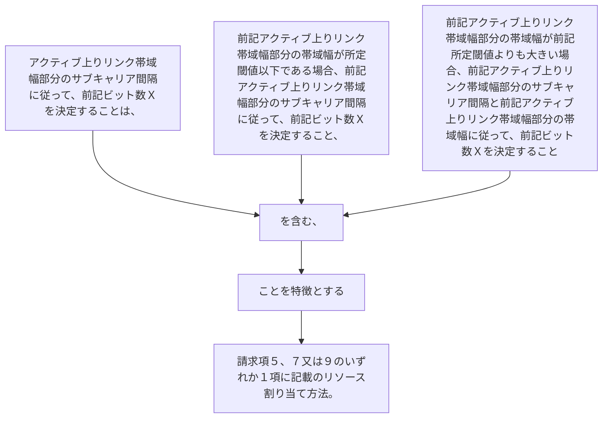

アクティブ上りリンク帯域幅部分のサブキャリア間隔に従って、前記ビット数Ｘを決定することは、
前記アクティブ上りリンク帯域幅部分の帯域幅が所定閾値以下である場合、前記アクティブ上りリンク帯域幅部分のサブキャリア間隔に従って、前記ビット数Ｘを決定すること、
又は、
前記アクティブ上りリンク帯域幅部分の帯域幅が前記所定閾値よりも大きい場合、前記アクティブ上りリンク帯域幅部分のサブキャリア間隔と前記アクティブ上りリンク帯域幅部分の帯域幅に従って、前記ビット数Ｘを決定することを含む、ことを特徴とする請求項５、７又は９のいずれか１項に記載のリソース割り当て方法。
