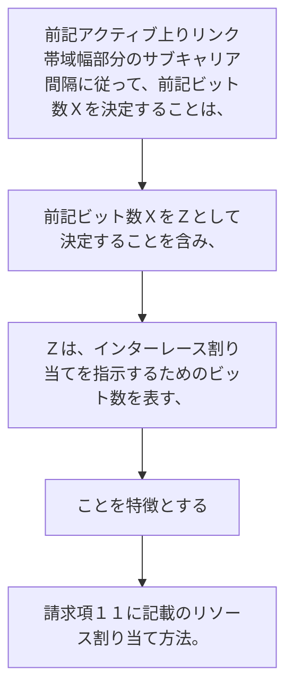

```mermaid
flowchart TD
A[前記アクティブ上りリンク帯域幅部分のサブキャリア間隔に従って、前記ビット数Ｘを決定することは、]
B[前記ビット数ＸをＺとして決定することを含み、]
C[Ｚは、インターレース割り当てを指示するためのビット数を表す、]
D[ことを特徴とする]
E[請求項１１に記載のリソース割り当て方法。]
A --> B
B --> C
C --> D
D --> E
```