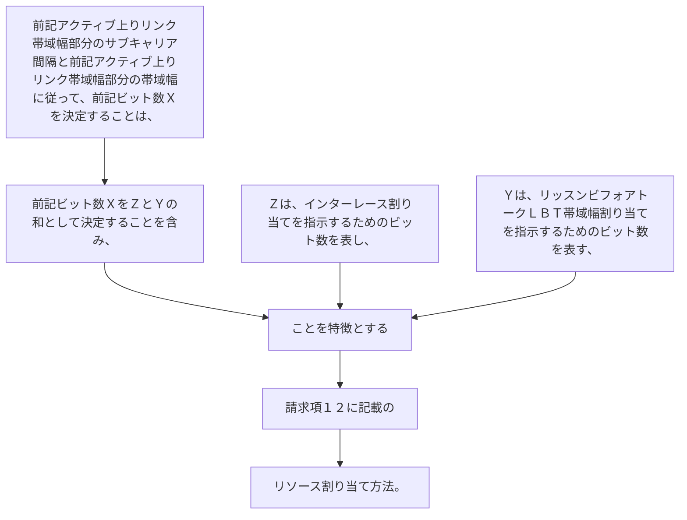

前記アクティブ上りリンク帯域幅部分のサブキャリア間隔と前記アクティブ上りリンク帯域幅部分の帯域幅に従って、前記ビット数Ｘを決定することは、
前記ビット数ＸをＺとＹの和として決定することを含み、Ｚは、インターレース割り当てを指示するためのビット数を表し、Ｙは、リッスンビフォアトークＬＢＴ帯域幅割り当てを指示するためのビット数を表す、ことを特徴とする請求項１２に記載のリソース割り当て方法。

```mermaid
flowchart TD
A[前記アクティブ上りリンク帯域幅部分のサブキャリア間隔と前記アクティブ上りリンク帯域幅部分の帯域幅に従って、前記ビット数Ｘを決定することは、]
B[前記ビット数ＸをＺとＹの和として決定することを含み、]
C[Ｚは、インターレース割り当てを指示するためのビット数を表し、]
D[Ｙは、リッスンビフォアトークＬＢＴ帯域幅割り当てを指示するためのビット数を表す、]
E[ことを特徴とする]
F[請求項１２に記載の]
G[リソース割り当て方法。]

A --> B
B --> E
C --> E
D --> E
E --> F
F --> G
```