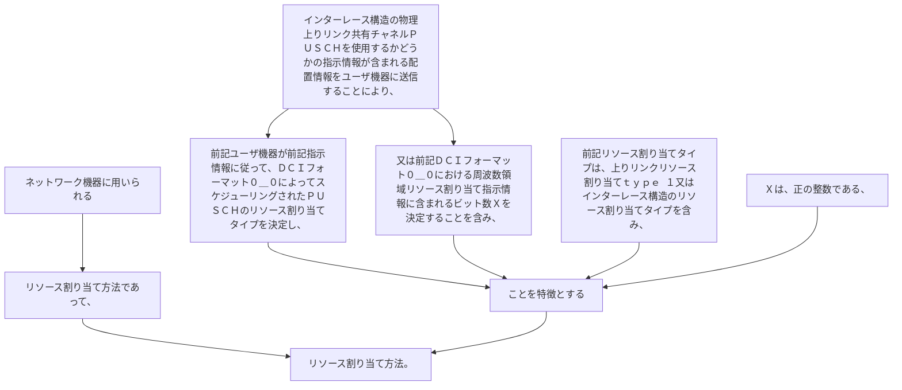

```mermaid
flowchart TD
A[ネットワーク機器に用いられる]
B[リソース割り当て方法であって、]
C[インターレース構造の物理上りリンク共有チャネルＰＵＳＣＨを使用するかどうかの指示情報が含まれる配置情報をユーザ機器に送信することにより、]
D[前記ユーザ機器が前記指示情報に従って、ＤＣＩフォーマット０＿０によってスケジューリングされたＰＵＳＣＨのリソース割り当てタイプを決定し、]
E[又は前記ＤＣＩフォーマット０＿０における周波数領域リソース割り当て指示情報に含まれるビット数Ｘを決定することを含み、]
F[前記リソース割り当てタイプは、上りリンクリソース割り当てｔｙｐｅ  １又はインターレース構造のリソース割り当てタイプを含み、]
G[Ｘは、正の整数である、]
H[ことを特徴とする]
I[リソース割り当て方法。]
A --> B
B --> I
C --> D
C --> E
D --> H
E --> H
F --> H
G --> H
H --> I
```