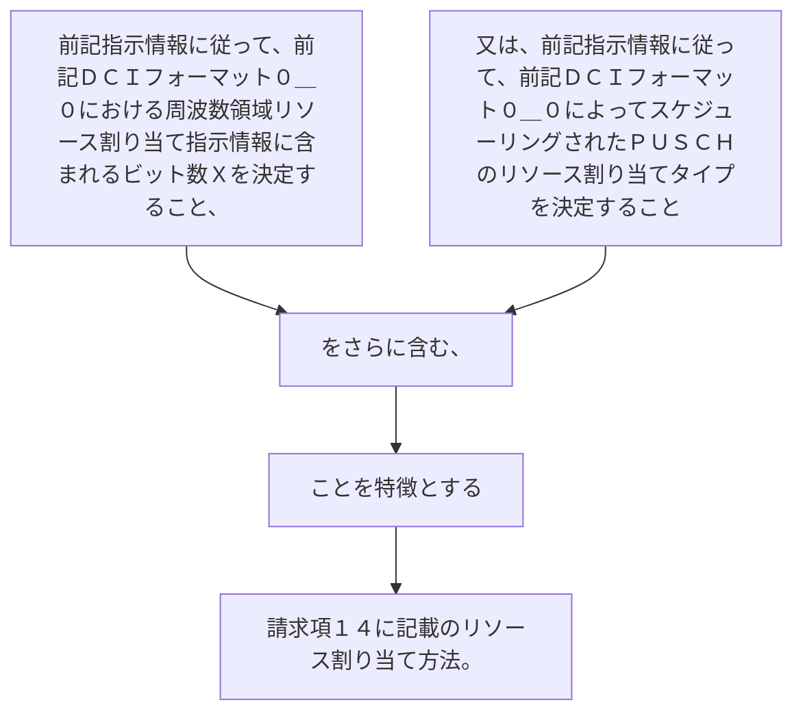

前記指示情報に従って、前記ＤＣＩフォーマット０＿０における周波数領域リソース割り当て指示情報に含まれるビット数Ｘを決定すること、
又は、
前記指示情報に従って、前記ＤＣＩフォーマット０＿０によってスケジューリングされたＰＵＳＣＨのリソース割り当てタイプを決定することをさらに含む、ことを特徴とする請求項１４に記載のリソース割り当て方法。

```mermaid
flowchart TD
A[前記指示情報に従って、前記ＤＣＩフォーマット０＿０における周波数領域リソース割り当て指示情報に含まれるビット数Ｘを決定すること、]
B[又は、前記指示情報に従って、前記ＤＣＩフォーマット０＿０によってスケジューリングされたＰＵＳＣＨのリソース割り当てタイプを決定すること]
C[をさらに含む、]
D[ことを特徴とする]
E[請求項１４に記載のリソース割り当て方法。]
A --> C
B --> C
C --> D
D --> E
```