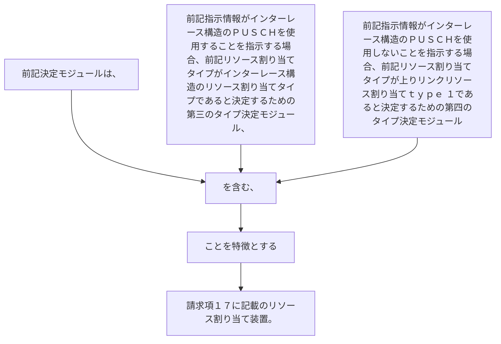

```mermaid
flowchart TD
A[前記決定モジュールは、]
B[前記指示情報がインターレース構造のＰＵＳＣＨを使用することを指示する場合、前記リソース割り当てタイプがインターレース構造のリソース割り当てタイプであると決定するための第三のタイプ決定モジュール、]
D[前記指示情報がインターレース構造のＰＵＳＣＨを使用しないことを指示する場合、前記リソース割り当てタイプが上りリンクリソース割り当てｔｙｐｅ １であると決定するための第四のタイプ決定モジュール]
E[を含む、]
F[ことを特徴とする]
G[請求項１７に記載のリソース割り当て装置。]
A --> E
B --> E
D --> E
E --> F
F --> G
```