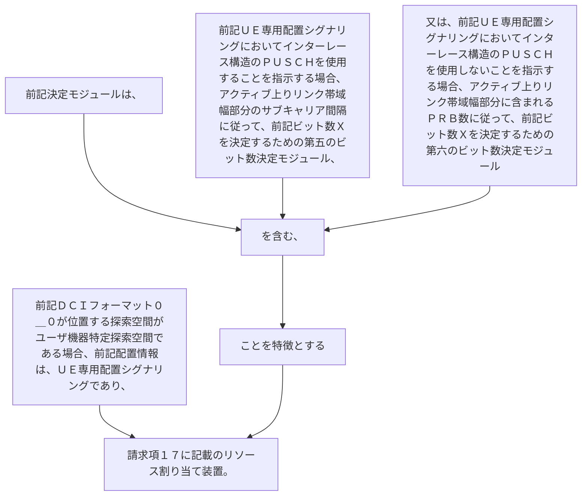

```mermaid
flowchart TD
A[前記ＤＣＩフォーマット０＿０が位置する探索空間がユーザ機器特定探索空間である場合、前記配置情報は、ＵＥ専用配置シグナリングであり、]
B[前記決定モジュールは、]
C[前記ＵＥ専用配置シグナリングにおいてインターレース構造のＰＵＳＣＨを使用することを指示する場合、アクティブ上りリンク帯域幅部分のサブキャリア間隔に従って、前記ビット数Ｘを決定するための第五のビット数決定モジュール、]
D[又は、前記ＵＥ専用配置シグナリングにおいてインターレース構造のＰＵＳＣＨを使用しないことを指示する場合、アクティブ上りリンク帯域幅部分に含まれるＰＲＢ数に従って、前記ビット数Ｘを決定するための第六のビット数決定モジュール]
E[を含む、]
F[ことを特徴とする]
G[請求項１７に記載のリソース割り当て装置。]
A --> G
B --> E
C --> E
D --> E
E --> F
F --> G
```