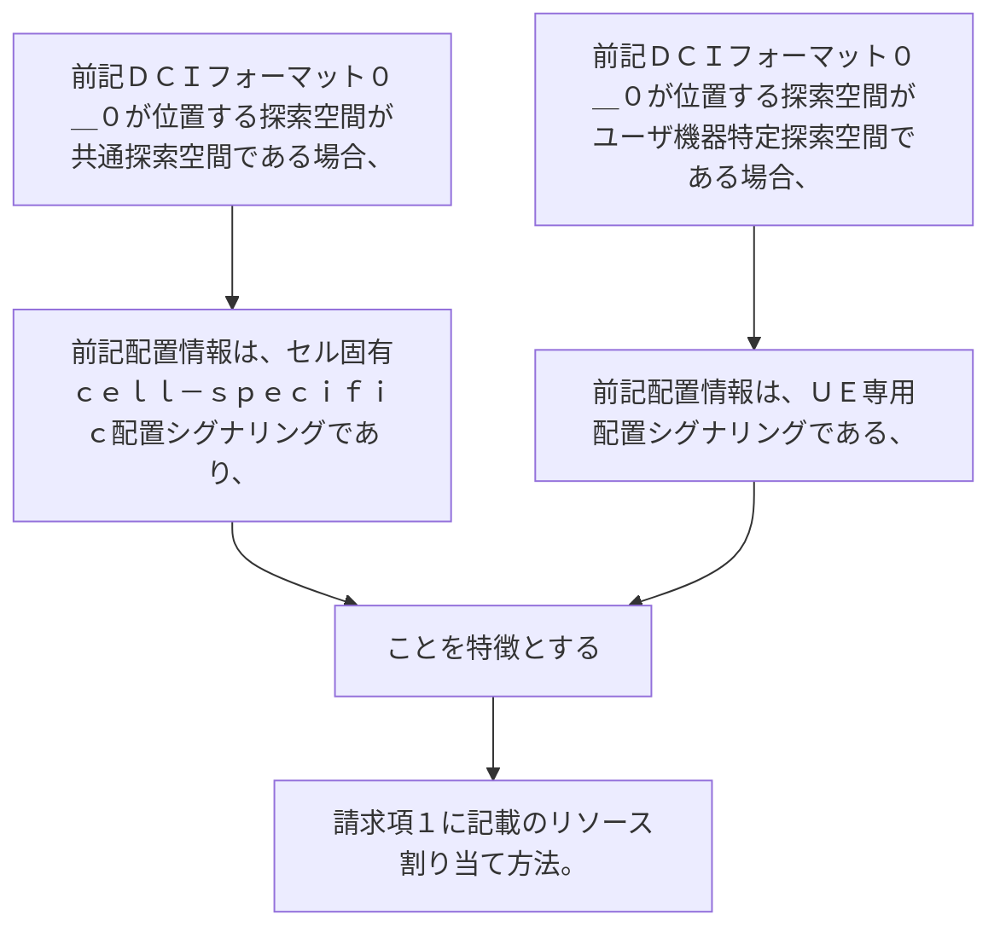

前記ＤＣＩフォーマット０＿０が位置する探索空間が共通探索空間である場合、前記配置情報は、セル固有ｃｅｌｌ－ｓｐｅｃｉｆｉｃ配置シグナリングであり、
又は、
前記ＤＣＩフォーマット０＿０が位置する探索空間がユーザ機器特定探索空間である場合、前記配置情報は、ＵＥ専用配置シグナリングである、ことを特徴とする請求項１に記載のリソース割り当て方法。

```mermaid
flowchart TD
A[前記ＤＣＩフォーマット０＿０が位置する探索空間が共通探索空間である場合、]
B[前記配置情報は、セル固有ｃｅｌｌ－ｓｐｅｃｉｆｉｃ配置シグナリングであり、]
C[前記ＤＣＩフォーマット０＿０が位置する探索空間がユーザ機器特定探索空間である場合、]
D[前記配置情報は、ＵＥ専用配置シグナリングである、]
E[ことを特徴とする]
F[請求項１に記載のリソース割り当て方法。]
A --> B
B --> E
C --> D
D --> E
E --> F
```