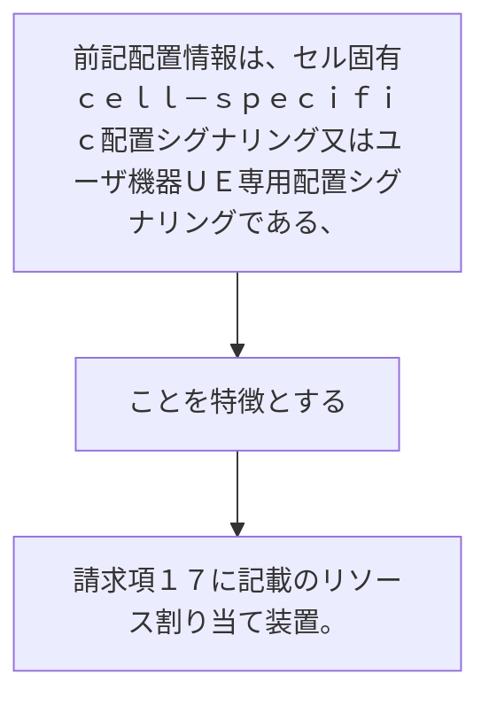

前記配置情報は、セル固有ｃｅｌｌ－ｓｐｅｃｉｆｉｃ配置シグナリング又はユーザ機器ＵＥ専用配置シグナリングである、ことを特徴とする請求項１７に記載のリソース割り当て装置。

```mermaid
flowchart TD
A[前記配置情報は、セル固有ｃｅｌｌ－ｓｐｅｃｉｆｉｃ配置シグナリング又はユーザ機器ＵＥ専用配置シグナリングである、]
B[ことを特徴とする]
C[請求項１７に記載のリソース割り当て装置。]
A --> B
B --> C
```