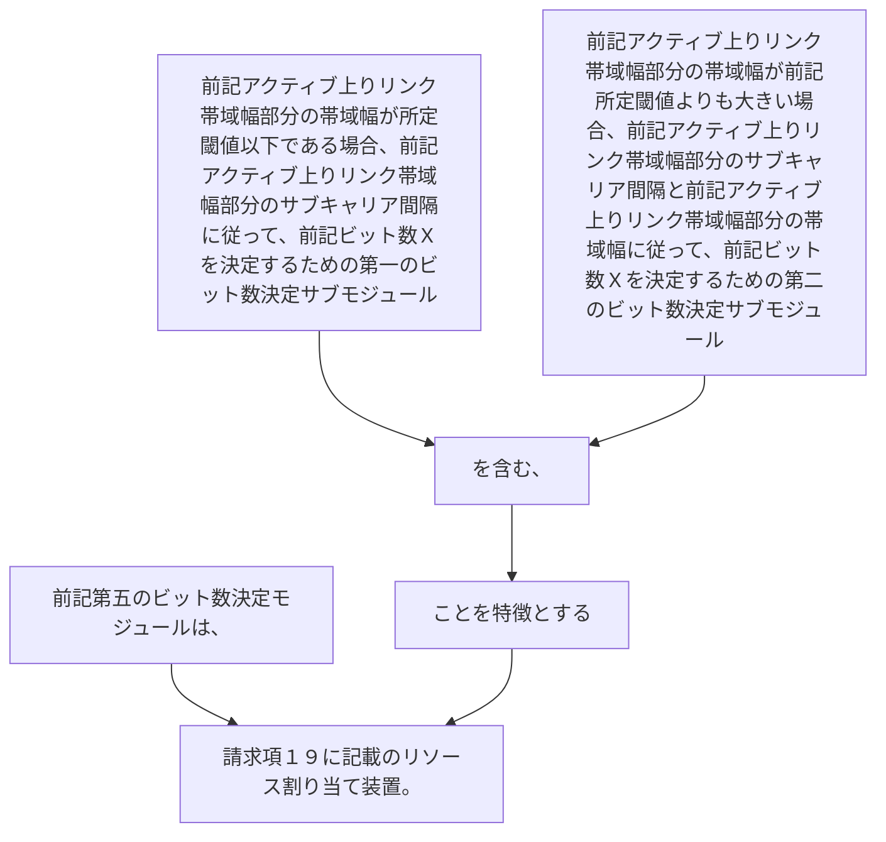

前記第五のビット数決定モジュールは、
前記アクティブ上りリンク帯域幅部分の帯域幅が所定閾値以下である場合、前記アクティブ上りリンク帯域幅部分のサブキャリア間隔に従って、前記ビット数Ｘを決定するための第一のビット数決定サブモジュール、
又は、
前記アクティブ上りリンク帯域幅部分の帯域幅が前記所定閾値よりも大きい場合、前記アクティブ上りリンク帯域幅部分のサブキャリア間隔と前記アクティブ上りリンク帯域幅部分の帯域幅に従って、前記ビット数Ｘを決定するための第二のビット数決定サブモジュールを含む、ことを特徴とする請求項１９に記載のリソース割り当て装置。
