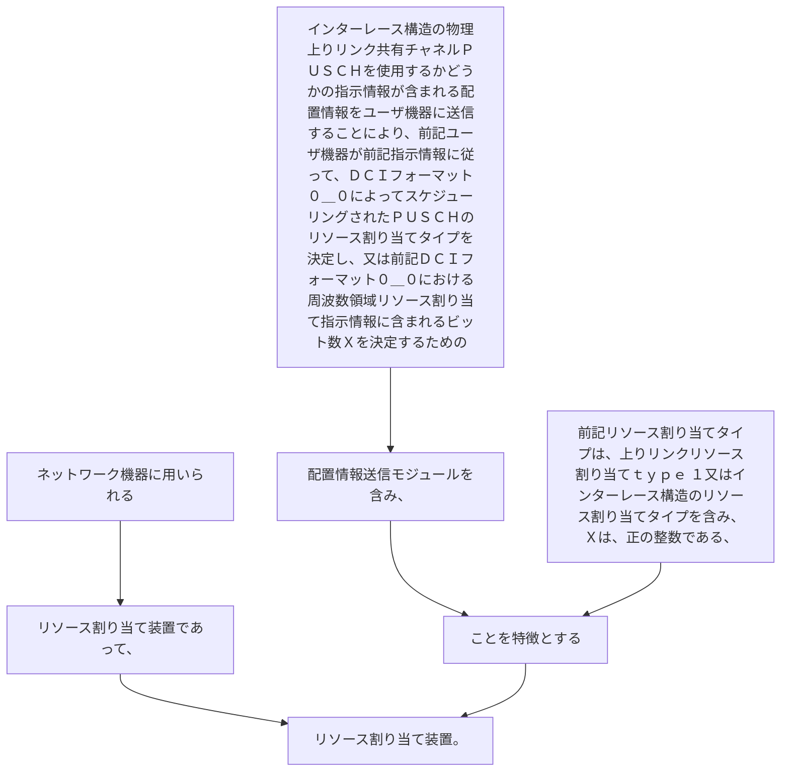

ネットワーク機器に用いられるリソース割り当て装置であって、
インターレース構造の物理上りリンク共有チャネルＰＵＳＣＨを使用するかどうかの指示情報が含まれる配置情報をユーザ機器に送信することにより、前記ユーザ機器が前記指示情報に従って、ＤＣＩフォーマット０＿０によってスケジューリングされたＰＵＳＣＨのリソース割り当てタイプを決定し、又は前記ＤＣＩフォーマット０＿０における周波数領域リソース割り当て指示情報に含まれるビット数Ｘを決定するための配置情報送信モジュールを含み、前記リソース割り当てタイプは、上りリンクリソース割り当てｔｙｐｅ  １又はインターレース構造のリソース割り当てタイプを含み、Ｘは、正の整数である、ことを特徴とするリソース割り当て装置。
