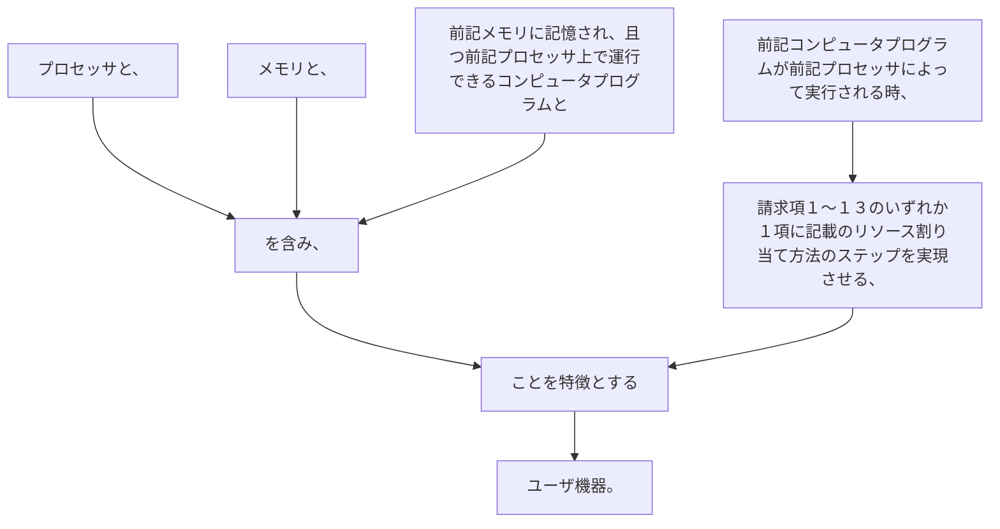

プロセッサと、メモリと、前記メモリに記憶され、且つ前記プロセッサ上で運行できるコンピュータプログラムとを含み、前記コンピュータプログラムが前記プロセッサによって実行される時、請求項１～１３のいずれか１項に記載のリソース割り当て方法のステップを実現させる、ことを特徴とするユーザ機器。

```mermaid
flowchart TD
A[プロセッサと、]
B[メモリと、]
C[前記メモリに記憶され、且つ前記プロセッサ上で運行できるコンピュータプログラムと]
D[を含み、]
E[前記コンピュータプログラムが前記プロセッサによって実行される時、]
F[請求項１～１３のいずれか１項に記載のリソース割り当て方法のステップを実現させる、]
G[ことを特徴とする]
H[ユーザ機器。]
A --> D
B --> D
C --> D
D --> G
E --> F
F --> G
G --> H
```