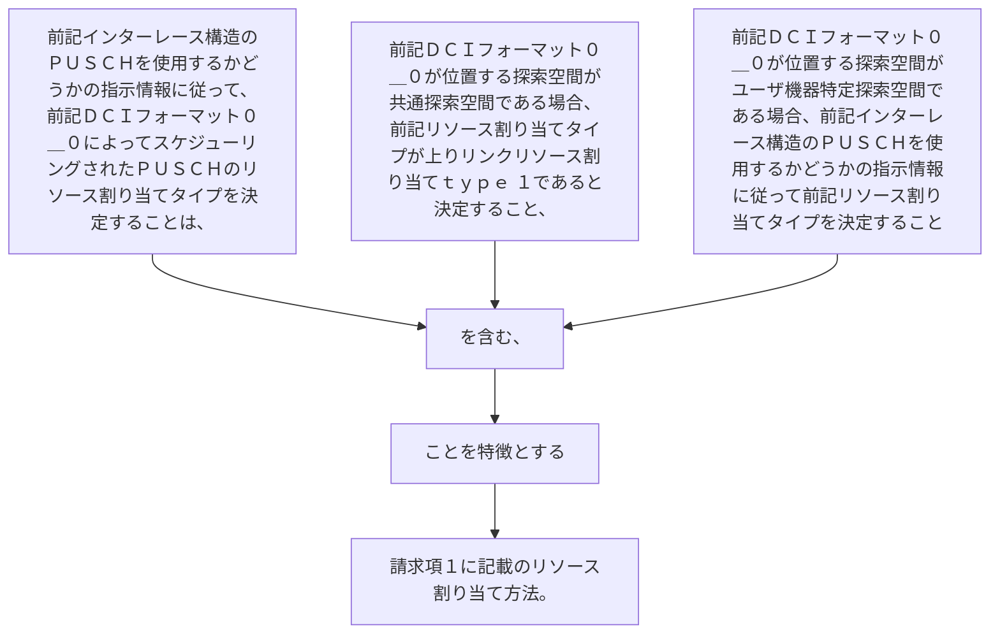

```mermaid
flowchart TD
A[前記インターレース構造のＰＵＳＣＨを使用するかどうかの指示情報に従って、前記ＤＣＩフォーマット０＿０によってスケジューリングされたＰＵＳＣＨのリソース割り当てタイプを決定することは、]
B[前記ＤＣＩフォーマット０＿０が位置する探索空間が共通探索空間である場合、前記リソース割り当てタイプが上りリンクリソース割り当てｔｙｐｅ １であると決定すること、]
C[前記ＤＣＩフォーマット０＿０が位置する探索空間がユーザ機器特定探索空間である場合、前記インターレース構造のＰＵＳＣＨを使用するかどうかの指示情報に従って前記リソース割り当てタイプを決定すること]
D[を含む、]
E[ことを特徴とする]
F[請求項１に記載のリソース割り当て方法。]
A --> D
B --> D
C --> D
D --> E
E --> F
```