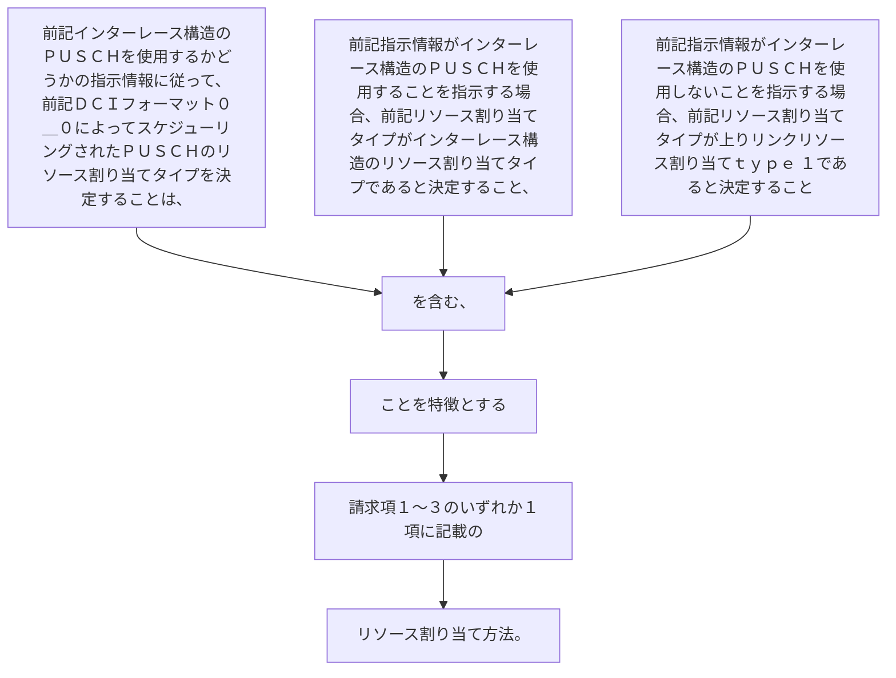

前記インターレース構造のＰＵＳＣＨを使用するかどうかの指示情報に従って、前記ＤＣＩフォーマット０＿０によってスケジューリングされたＰＵＳＣＨのリソース割り当てタイプを決定することは、
前記指示情報がインターレース構造のＰＵＳＣＨを使用することを指示する場合、前記リソース割り当てタイプがインターレース構造のリソース割り当てタイプであると決定すること、
又は、
前記指示情報がインターレース構造のＰＵＳＣＨを使用しないことを指示する場合、前記リソース割り当てタイプが上りリンクリソース割り当てｔｙｐｅ  １であると決定することを含む、ことを特徴とする請求項１～３のいずれか１項に記載のリソース割り当て方法。
