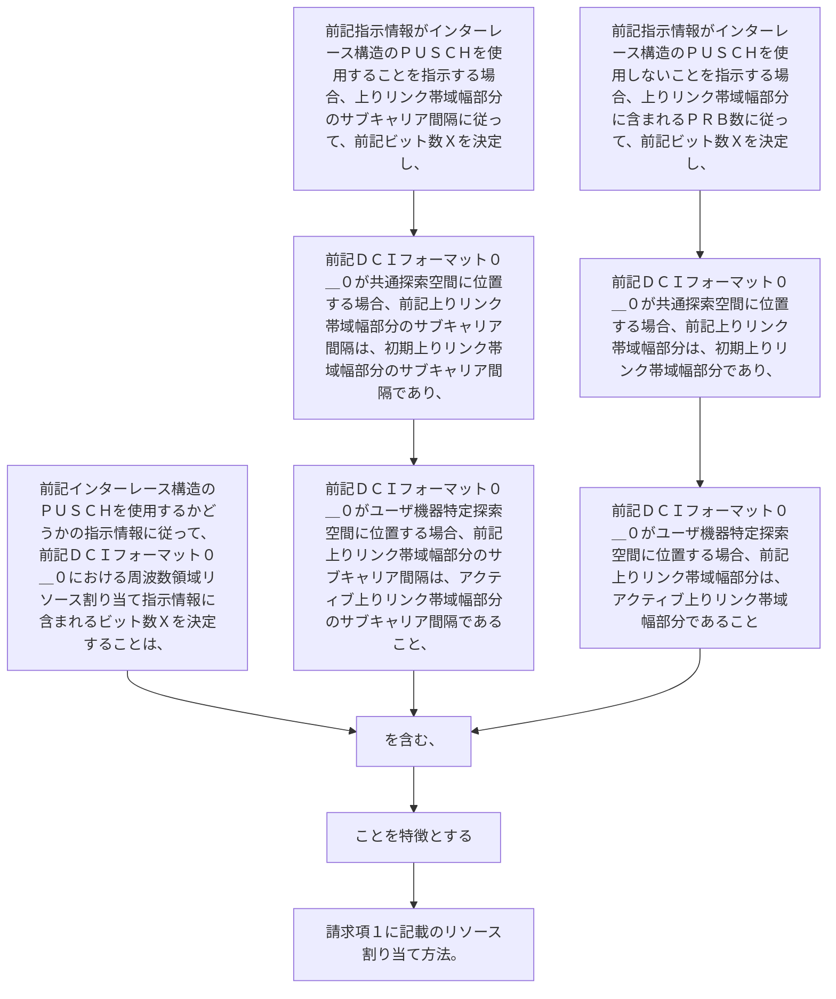

```mermaid
flowchart TD
A[前記インターレース構造のＰＵＳＣＨを使用するかどうかの指示情報に従って、前記ＤＣＩフォーマット０＿０における周波数領域リソース割り当て指示情報に含まれるビット数Ｘを決定することは、]
B[前記指示情報がインターレース構造のＰＵＳＣＨを使用することを指示する場合、上りリンク帯域幅部分のサブキャリア間隔に従って、前記ビット数Ｘを決定し、]
C[前記ＤＣＩフォーマット０＿０が共通探索空間に位置する場合、前記上りリンク帯域幅部分のサブキャリア間隔は、初期上りリンク帯域幅部分のサブキャリア間隔であり、]
D[前記ＤＣＩフォーマット０＿０がユーザ機器特定探索空間に位置する場合、前記上りリンク帯域幅部分のサブキャリア間隔は、アクティブ上りリンク帯域幅部分のサブキャリア間隔であること、]
E[前記指示情報がインターレース構造のＰＵＳＣＨを使用しないことを指示する場合、上りリンク帯域幅部分に含まれるＰＲＢ数に従って、前記ビット数Ｘを決定し、]
F[前記ＤＣＩフォーマット０＿０が共通探索空間に位置する場合、前記上りリンク帯域幅部分は、初期上りリンク帯域幅部分であり、]
G[前記ＤＣＩフォーマット０＿０がユーザ機器特定探索空間に位置する場合、前記上りリンク帯域幅部分は、アクティブ上りリンク帯域幅部分であること]
H[を含む、]
I[ことを特徴とする]
J[請求項１に記載のリソース割り当て方法。]
A --> H
B --> C
C --> D
D --> H
E --> F
F --> G
G --> H
H --> I
I --> J
```