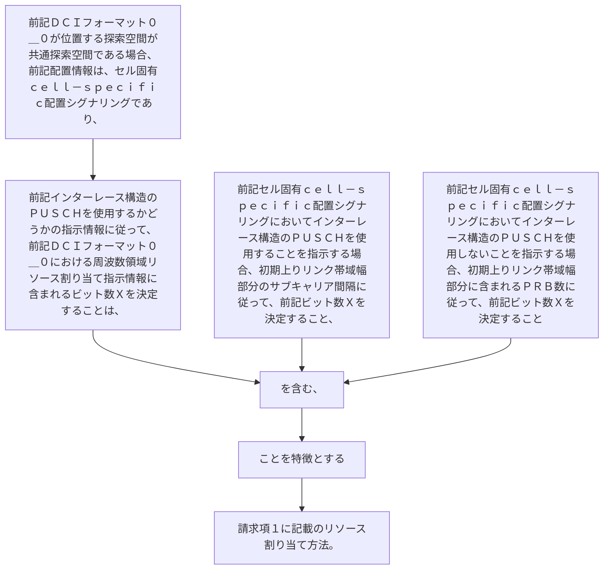

前記ＤＣＩフォーマット０＿０が位置する探索空間が共通探索空間である場合、前記配置情報は、セル固有ｃｅｌｌ－ｓｐｅｃｉｆｉｃ配置シグナリングであり、
前記インターレース構造のＰＵＳＣＨを使用するかどうかの指示情報に従って、前記ＤＣＩフォーマット０＿０における周波数領域リソース割り当て指示情報に含まれるビット数Ｘを決定することは、
前記セル固有ｃｅｌｌ－ｓｐｅｃｉｆｉｃ配置シグナリングにおいてインターレース構造のＰＵＳＣＨを使用することを指示する場合、初期上りリンク帯域幅部分のサブキャリア間隔に従って、前記ビット数Ｘを決定すること、
又は、
前記セル固有ｃｅｌｌ－ｓｐｅｃｉｆｉｃ配置シグナリングにおいてインターレース構造のＰＵＳＣＨを使用しないことを指示する場合、初期上りリンク帯域幅部分に含まれるＰＲＢ数に従って、前記ビット数Ｘを決定することを含む、ことを特徴とする請求項１に記載のリソース割り当て方法。
