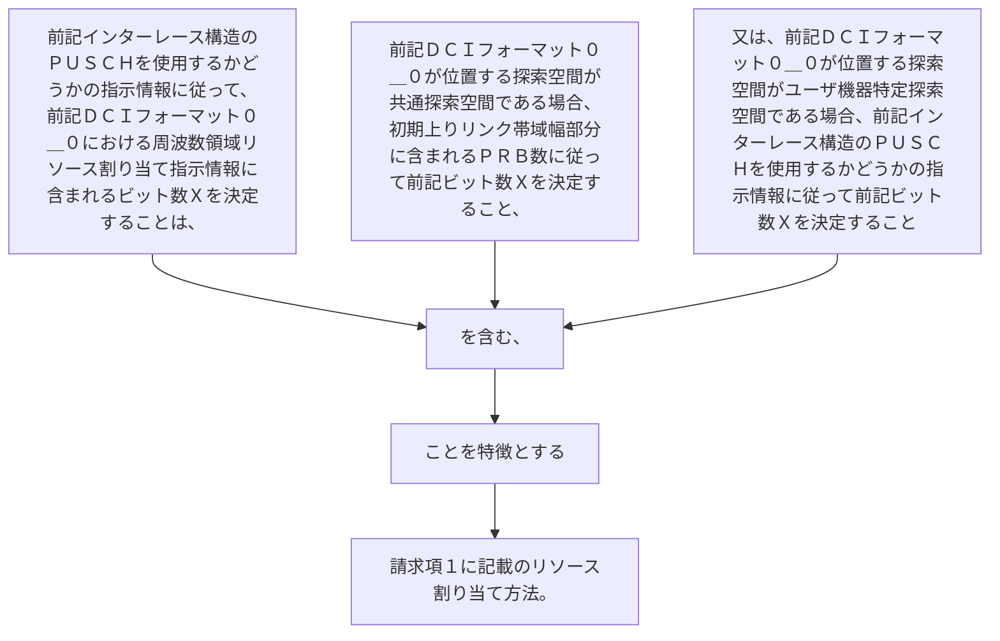

```mermaid
flowchart TD
A[前記インターレース構造のＰＵＳＣＨを使用するかどうかの指示情報に従って、前記ＤＣＩフォーマット０＿０における周波数領域リソース割り当て指示情報に含まれるビット数Ｘを決定することは、]
B[前記ＤＣＩフォーマット０＿０が位置する探索空間が共通探索空間である場合、初期上りリンク帯域幅部分に含まれるＰＲＢ数に従って前記ビット数Ｘを決定すること、]
C[又は、前記ＤＣＩフォーマット０＿０が位置する探索空間がユーザ機器特定探索空間である場合、前記インターレース構造のＰＵＳＣＨを使用するかどうかの指示情報に従って前記ビット数Ｘを決定すること]
D[を含む、]
E[ことを特徴とする]
F[請求項１に記載のリソース割り当て方法。]
A --> D
B --> D
C --> D
D --> E
E --> F
```