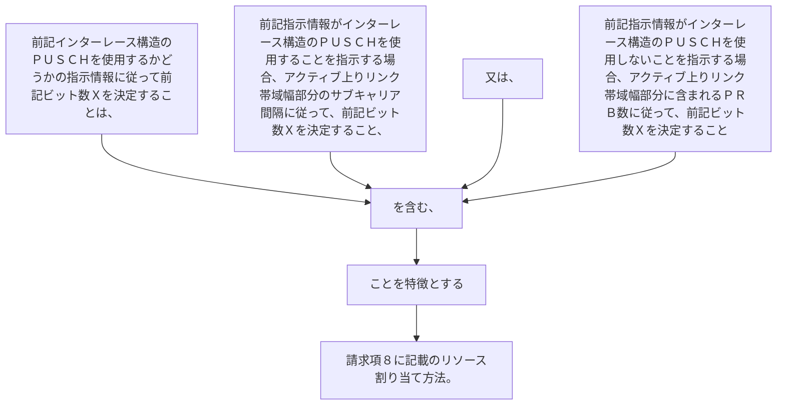

```mermaid
flowchart TD
A[前記インターレース構造のＰＵＳＣＨを使用するかどうかの指示情報に従って前記ビット数Ｘを決定することは、]
B[前記指示情報がインターレース構造のＰＵＳＣＨを使用することを指示する場合、アクティブ上りリンク帯域幅部分のサブキャリア間隔に従って、前記ビット数Ｘを決定すること、]
C[又は、]
D[前記指示情報がインターレース構造のＰＵＳＣＨを使用しないことを指示する場合、アクティブ上りリンク帯域幅部分に含まれるＰＲＢ数に従って、前記ビット数Ｘを決定すること]
E[を含む、]
F[ことを特徴とする]
G[請求項８に記載のリソース割り当て方法。]
A --> E
B --> E
C --> E
D --> E
E --> F
F --> G
```