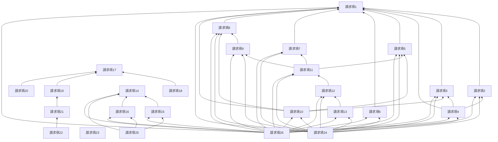

```mermaid
flowchart BT
A[請求項1]
B[請求項2]
C[請求項3]
D[請求項4]
E[請求項5]
F[請求項6]
G[請求項7]
H[請求項8]
I[請求項9]
J[請求項10]
K[請求項11]
L[請求項12]
M[請求項13]
N[請求項14]
O[請求項15]
P[請求項16]
Q[請求項17]
R[請求項18]
S[請求項19]
T[請求項20]
U[請求項21]
V[請求項22]
W[請求項23]
X[請求項24]
Y[請求項25]
Z[請求項26]
B --> A
C --> A
D --> A
D --> B
D --> C
E --> A
F --> A
G --> A
H --> A
I --> H
J --> A
J --> C
J --> E
J --> H
K --> E
K --> G
K --> I
L --> K
M --> L
O --> N
P --> N
R --> Q
S --> Q
T --> Q
U --> S
V --> U
X --> A
X --> B
X --> C
X --> D
X --> E
X --> F
X --> G
X --> H
X --> I
X --> J
X --> K
X --> L
X --> M
Y --> N
Y --> O
Y --> P
Z --> A
Z --> B
Z --> C
Z --> D
Z --> E
Z --> F
Z --> G
Z --> H
Z --> I
Z --> J
Z --> K
Z --> L
Z --> M
Z --> N
Z --> O
Z --> P
```
