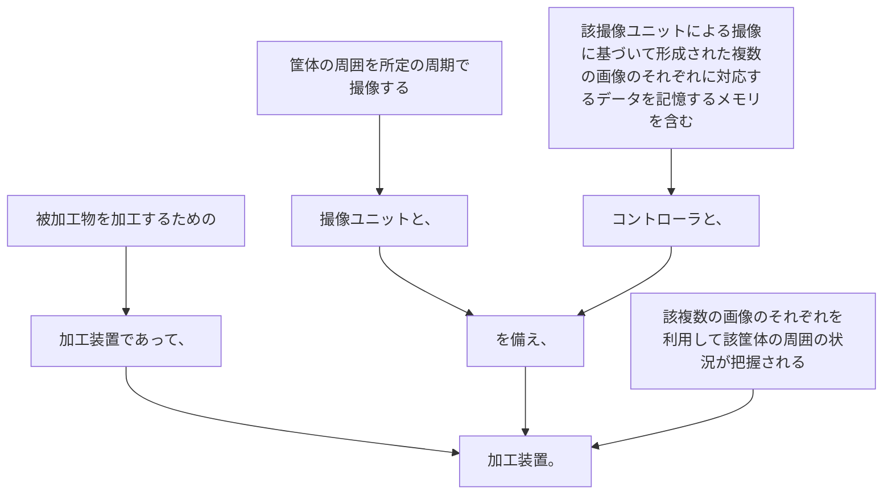

被加工物を加工するための加工装置であって、
筐体の周囲を所定の周期で撮像する撮像ユニットと、
該撮像ユニットによる撮像に基づいて形成された複数の画像のそれぞれに対応するデータを記憶するメモリを含むコントローラと、を備え、
該複数の画像のそれぞれを利用して該筐体の周囲の状況が把握される加工装置。

```mermaid
flowchart TD
A[被加工物を加工するための]
B[加工装置であって、]
C[筐体の周囲を所定の周期で撮像する]
D[撮像ユニットと、]
E[該撮像ユニットによる撮像に基づいて形成された複数の画像のそれぞれに対応するデータを記憶するメモリを含む]
F[コントローラと、]
G[を備え、]
H[該複数の画像のそれぞれを利用して該筐体の周囲の状況が把握される]
I[加工装置。]
A --> B
B --> I
C --> D
E --> F
D --> G
F --> G
G --> I
H --> I
```