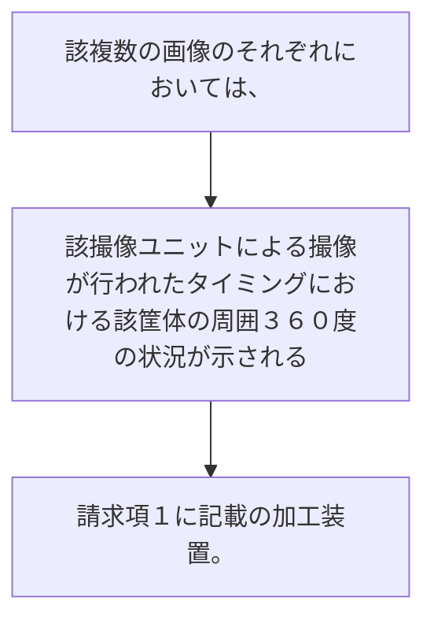

該複数の画像のそれぞれにおいては、該撮像ユニットによる撮像が行われたタイミングにおける該筐体の周囲３６０度の状況が示される請求項１に記載の加工装置。

```mermaid
flowchart TD
A[該複数の画像のそれぞれにおいては、]
B[該撮像ユニットによる撮像が行われたタイミングにおける該筐体の周囲３６０度の状況が示される]
C[請求項１に記載の加工装置。]
A --> B
B --> C
```