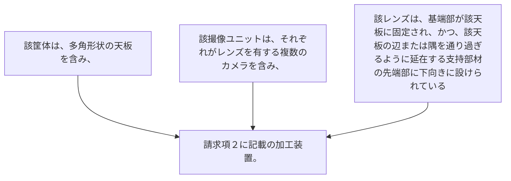

該筐体は、多角形状の天板を含み、
該撮像ユニットは、それぞれがレンズを有する複数のカメラを含み、
該レンズは、基端部が該天板に固定され、かつ、該天板の辺または隅を通り過ぎるように延在する支持部材の先端部に下向きに設けられている請求項２に記載の加工装置。

```mermaid
flowchart TD
A[該筐体は、多角形状の天板を含み、]
B[該撮像ユニットは、それぞれがレンズを有する複数のカメラを含み、]
C[該レンズは、基端部が該天板に固定され、かつ、該天板の辺または隅を通り過ぎるように延在する支持部材の先端部に下向きに設けられている]
D[請求項２に記載の加工装置。]
A --> D
B --> D
C --> D
```