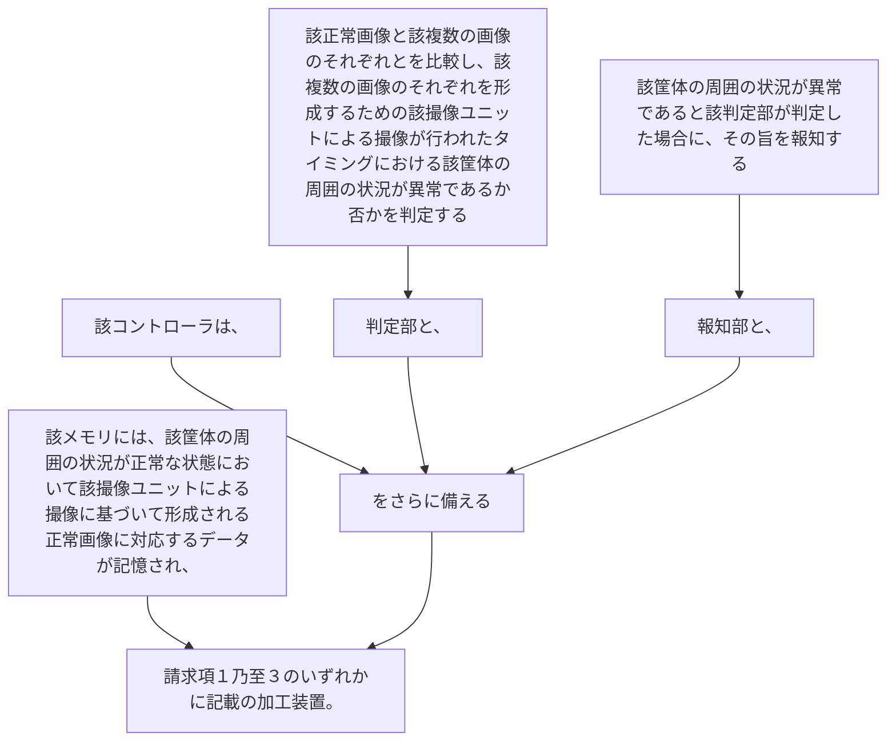

該メモリには、該筐体の周囲の状況が正常な状態において該撮像ユニットによる撮像に基づいて形成される正常画像に対応するデータが記憶され、
該コントローラは、
該正常画像と該複数の画像のそれぞれとを比較し、該複数の画像のそれぞれを形成するための該撮像ユニットによる撮像が行われたタイミングにおける該筐体の周囲の状況が異常であるか否かを判定する判定部と、
該筐体の周囲の状況が異常であると該判定部が判定した場合に、その旨を報知する報知部と、
をさらに備える請求項１乃至３のいずれかに記載の加工装置。
