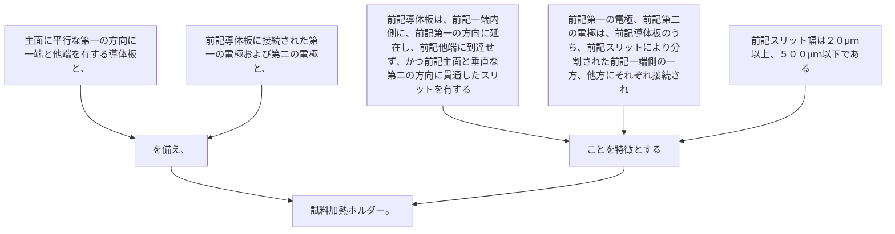

```mermaid
flowchart TD
A[主面に平行な第一の方向に一端と他端を有する導体板と、]
B[前記導体板に接続された第一の電極および第二の電極と、]
C[を備え、]
D[前記導体板は、前記一端内側に、前記第一の方向に延在し、前記他端に到達せず、かつ前記主面と垂直な第二の方向に貫通したスリットを有する]
E[前記第一の電極、前記第二の電極は、前記導体板のうち、前記スリットにより分割された前記一端側の一方、他方にそれぞれ接続され]
F[前記スリット幅は２０μｍ以上、５００μｍ以下である]
G[ことを特徴とする]
H[試料加熱ホルダー。]
A --> C
B --> C
C --> H
D --> G
E --> G
F --> G
G --> H
```