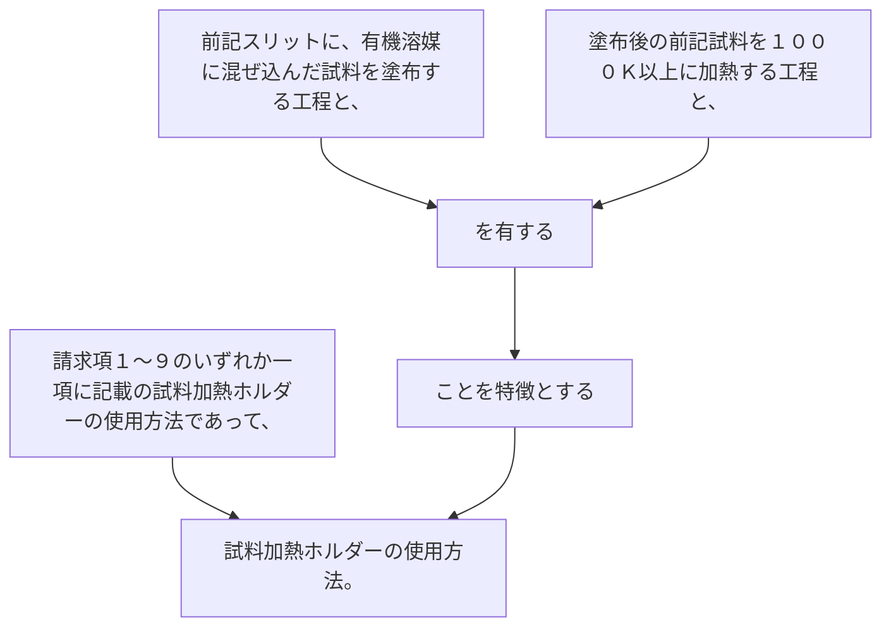

```mermaid
flowchart TD
A[請求項１～９のいずれか一項に記載の試料加熱ホルダーの使用方法であって、]
B[前記スリットに、有機溶媒に混ぜ込んだ試料を塗布する工程と、]
C[塗布後の前記試料を１０００Ｋ以上に加熱する工程と、]
D[を有する]
E[ことを特徴とする]
F[試料加熱ホルダーの使用方法。]
A --> F
B --> D
C --> D
D --> E
E --> F
```