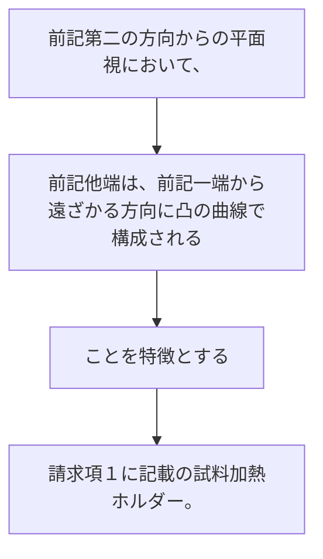

前記第二の方向からの平面視において、前記他端は、前記一端から遠ざかる方向に凸の曲線で構成されることを特徴とする請求項１に記載の試料加熱ホルダー。

```mermaid
flowchart TD
A[前記第二の方向からの平面視において、]
B[前記他端は、前記一端から遠ざかる方向に凸の曲線で構成される]
C[ことを特徴とする]
D[請求項１に記載の試料加熱ホルダー。]
A --> B
B --> C
C --> D
```