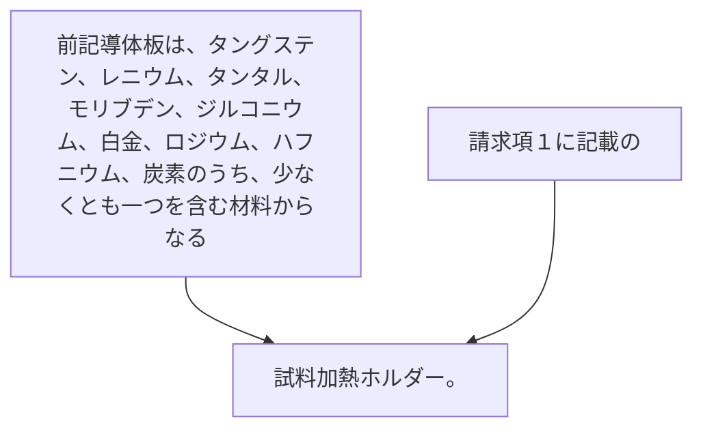

前記導体板は、タングステン、レニウム、タンタル、モリブデン、ジルコニウム、白金、ロジウム、ハフニウム、炭素のうち、少なくとも一つを含む材料からなる、請求項１に記載の試料加熱ホルダー。

```mermaid
flowchart TD
A[前記導体板は、タングステン、レニウム、タンタル、モリブデン、ジルコニウム、白金、ロジウム、ハフニウム、炭素のうち、少なくとも一つを含む材料からなる]
B[請求項１に記載の]
C[試料加熱ホルダー。]
A --> C
B --> C
```