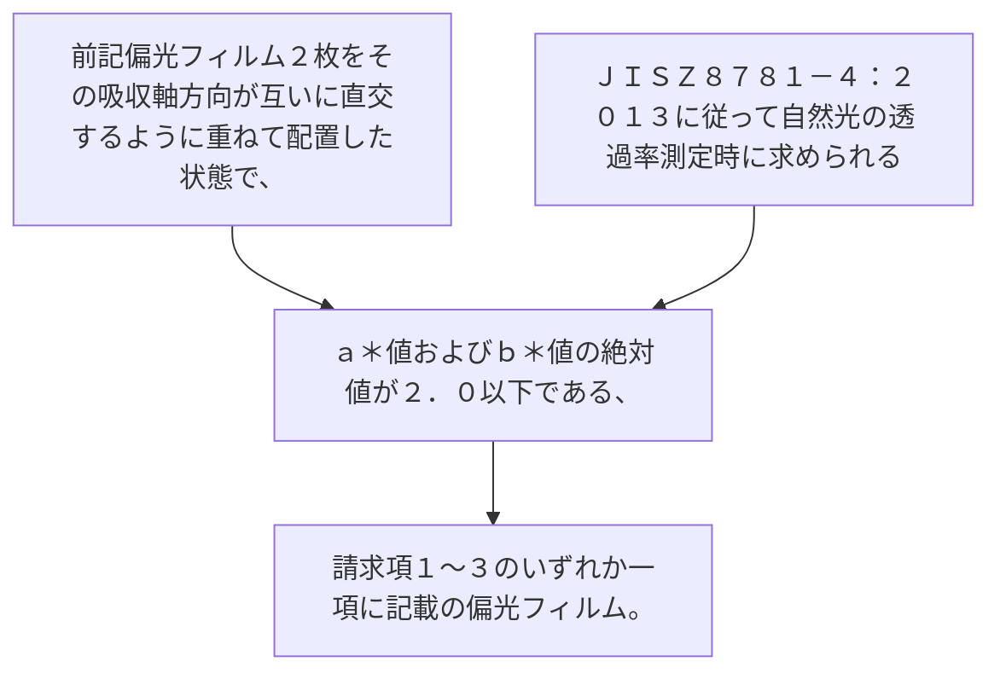

前記偏光フィルム２枚をその吸収軸方向が互いに直交するように重ねて配置した状態で、ＪＩＳＺ８７８１－４：２０１３に従って自然光の透過率測定時に求められるａ＊値およびｂ＊値の絶対値が２．０以下である、請求項１～３のいずれか一項に記載の偏光フィルム。

```mermaid
flowchart TD
A[前記偏光フィルム２枚をその吸収軸方向が互いに直交するように重ねて配置した状態で、]
B[ＪＩＳＺ８７８１－４：２０１３に従って自然光の透過率測定時に求められる]
C[ａ＊値およびｂ＊値の絶対値が２．０以下である、]
D[請求項１～３のいずれか一項に記載の偏光フィルム。]
A --> C
B --> C
C --> D
```