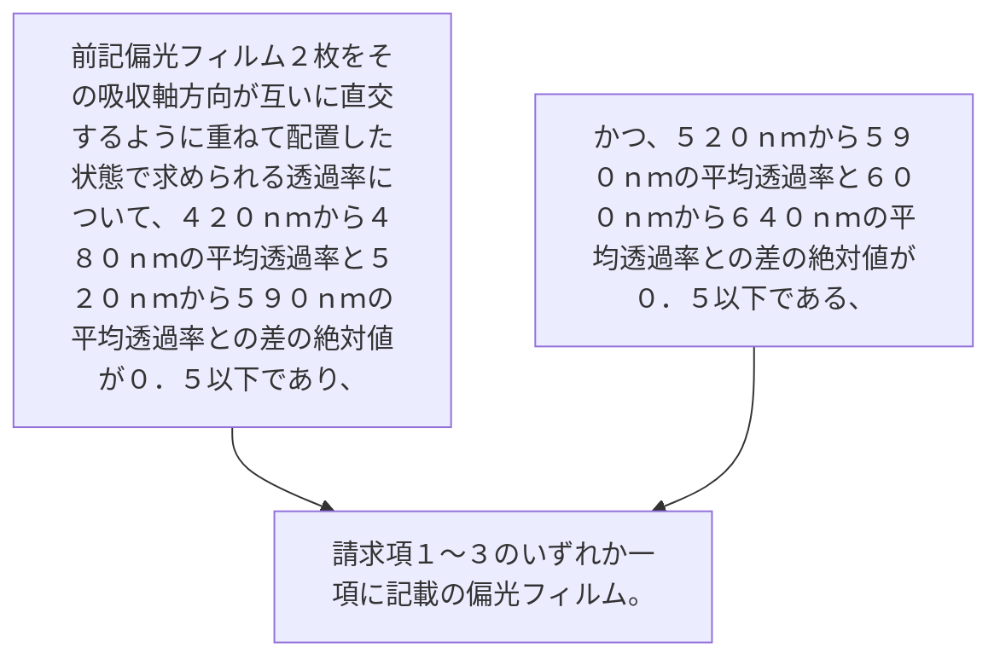

```mermaid
flowchart TD
A[前記偏光フィルム２枚をその吸収軸方向が互いに直交するように重ねて配置した状態で求められる透過率について、４２０ｎｍから４８０ｎｍの平均透過率と５２０ｎｍから５９０ｎｍの平均透過率との差の絶対値が０．５以下であり、]
B[かつ、５２０ｎｍから５９０ｎｍの平均透過率と６００ｎｍから６４０ｎｍの平均透過率との差の絶対値が０．５以下である、]
C[請求項１～３のいずれか一項に記載の偏光フィルム。]
A --> C
B --> C
```