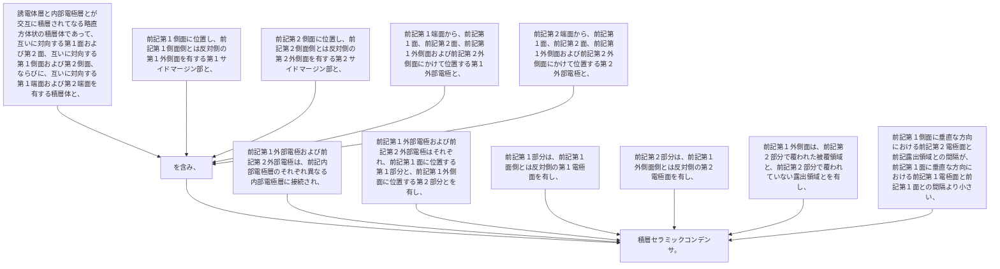

```mermaid
flowchart TD
A[誘電体層と内部電極層とが交互に積層されてなる略直方体状の積層体であって、互いに対向する第１面および第２面、互いに対向する第１側面および第２側面、ならびに、互いに対向する第１端面および第２端面を有する積層体と、]
B[前記第１側面に位置し、前記第１側面側とは反対側の第１外側面を有する第１サイドマージン部と、]
C[前記第２側面に位置し、前記第２側面側とは反対側の第２外側面を有する第２サイドマージン部と、]
D[前記第１端面から、前記第１面、前記第２面、前記第１外側面および前記第２外側面にかけて位置する第１外部電極と、]
E[前記第２端面から、前記第１面、前記第２面、前記第１外側面および前記第２外側面にかけて位置する第２外部電極と、]
F[を含み、]
G[前記第１外部電極および前記第２外部電極は、前記内部電極層のそれぞれ異なる内部電極層に接続され、]
H[前記第１外部電極および前記第２外部電極はそれぞれ、前記第１面に位置する第１部分と、前記第１外側面に位置する第２部分とを有し、]
I[前記第１部分は、前記第１面側とは反対側の第１電極面を有し、]
J[前記第２部分は、前記第１外側面側とは反対側の第２電極面を有し、]
K[前記第１外側面は、前記第２部分で覆われた被覆領域と、前記第２部分で覆われていない露出領域とを有し、]
L[前記第１側面に垂直な方向における前記第２電極面と前記露出領域との間隔が、前記第１面に垂直な方向における前記第１電極面と前記第１面との間隔より小さい、]
M[積層セラミックコンデンサ。]
A --> F
B --> F
C --> F
D --> F
E --> F
F --> M
G --> M
H --> M
I --> M
J --> M
K --> M
L --> M
```