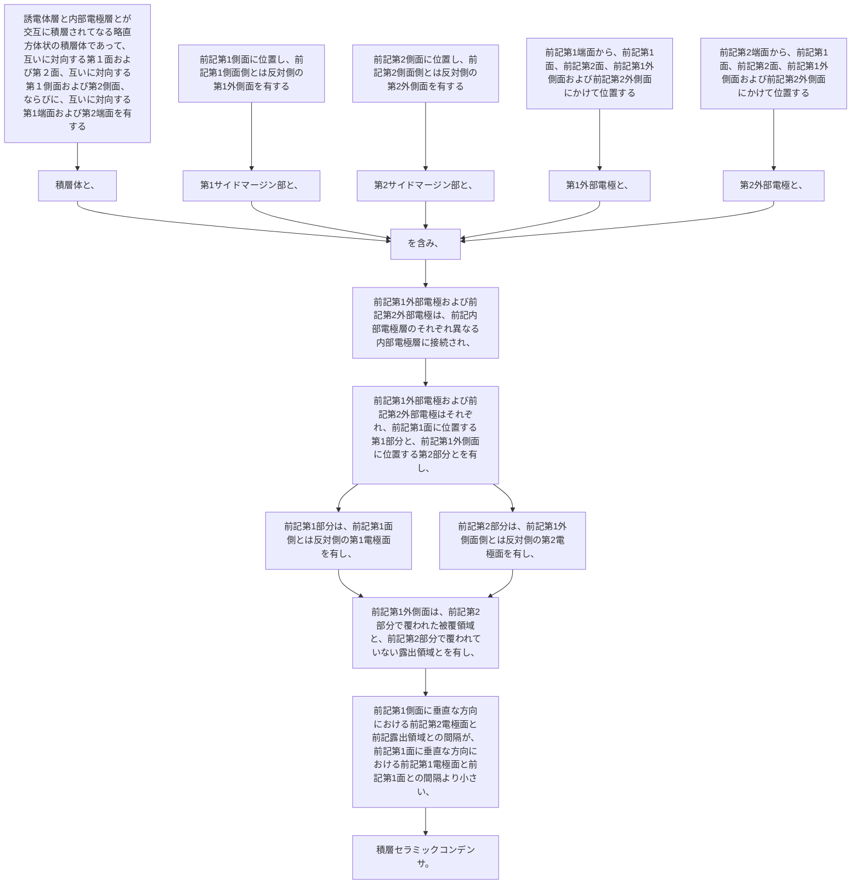

```mermaid
flowchart TD
A[誘電体層と内部電極層とが交互に積層されてなる略直方体状の積層体であって、互いに対向する第１面および第２面、互いに対向する第１側面および第2側面、ならびに、互いに対向する第1端面および第2端面を有する]
B[積層体と、]
C[前記第1側面に位置し、前記第1側面側とは反対側の第1外側面を有する]
D[第1サイドマージン部と、]
E[前記第2側面に位置し、前記第2側面側とは反対側の第2外側面を有する]
F[第2サイドマージン部と、]
G[前記第1端面から、前記第1面、前記第2面、前記第1外側面および前記第2外側面にかけて位置する]
H[第1外部電極と、]
I[前記第2端面から、前記第1面、前記第2面、前記第1外側面および前記第2外側面にかけて位置する]
J[第2外部電極と、]
K[を含み、]
L[前記第1外部電極および前記第2外部電極は、前記内部電極層のそれぞれ異なる内部電極層に接続され、]
M[前記第1外部電極および前記第2外部電極はそれぞれ、前記第1面に位置する第1部分と、前記第1外側面に位置する第2部分とを有し、]
N[前記第1部分は、前記第1面側とは反対側の第1電極面を有し、]
O[前記第2部分は、前記第1外側面側とは反対側の第2電極面を有し、]
P[前記第1外側面は、前記第2部分で覆われた被覆領域と、前記第2部分で覆われていない露出領域とを有し、]
Q[前記第1側面に垂直な方向における前記第2電極面と前記露出領域との間隔が、前記第1面に垂直な方向における前記第1電極面と前記第1面との間隔より小さい、]
R[積層セラミックコンデンサ。]

A --> B
C --> D
E --> F
G --> H
I --> J

B --> K
D --> K
F --> K
H --> K
J --> K

K --> L
L --> M
M --> N
M --> O
N --> P
O --> P
P --> Q
Q --> R
```