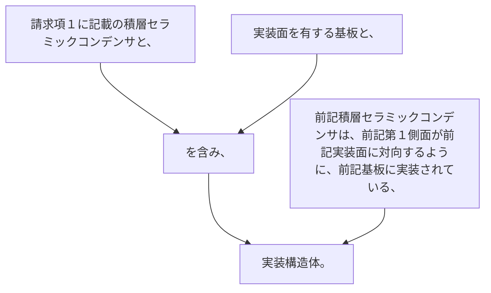

請求項１に記載の積層セラミックコンデンサと、
実装面を有する基板と、を含み、
前記積層セラミックコンデンサは、前記第１側面が前記実装面に対向するように、前記基板に実装されている、実装構造体。

```mermaid
flowchart TD
A[請求項１に記載の積層セラミックコンデンサと、]
B[実装面を有する基板と、]
C[を含み、]
D[前記積層セラミックコンデンサは、前記第１側面が前記実装面に対向するように、前記基板に実装されている、]
E[実装構造体。]
A --> C
B --> C
C --> E
D --> E
```