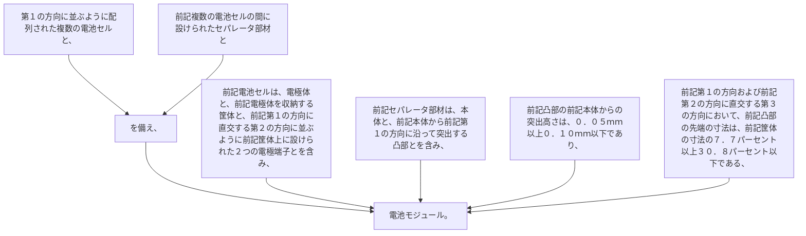

第１の方向に並ぶように配列された複数の電池セルと、
前記複数の電池セルの間に設けられたセパレータ部材とを備え、
前記電池セルは、電極体と、前記電極体を収納する筐体と、前記第１の方向に直交する第２の方向に並ぶように前記筐体上に設けられた２つの電極端子とを含み、
前記セパレータ部材は、本体と、前記本体から前記第１の方向に沿って突出する凸部とを含み、
前記凸部の前記本体からの突出高さは、０．０５ｍｍ以上０．１０ｍｍ以下であり、
前記第１の方向および前記第２の方向に直交する第３の方向において、前記凸部の先端の寸法は、前記筐体の寸法の７．７パーセント以上３０．８パーセント以下である、電池モジュール。
