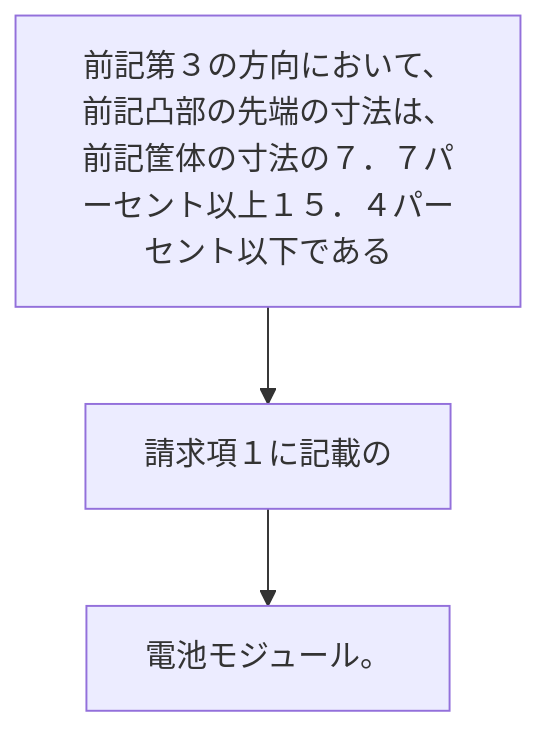

前記第３の方向において、前記凸部の先端の寸法は、前記筐体の寸法の７．７パーセント以上１５．４パーセント以下である、請求項１に記載の電池モジュール。

```mermaid
flowchart TD
A[前記第３の方向において、前記凸部の先端の寸法は、前記筐体の寸法の７．７パーセント以上１５．４パーセント以下である]
B[請求項１に記載の]
C[電池モジュール。]
A --> B
B --> C
```