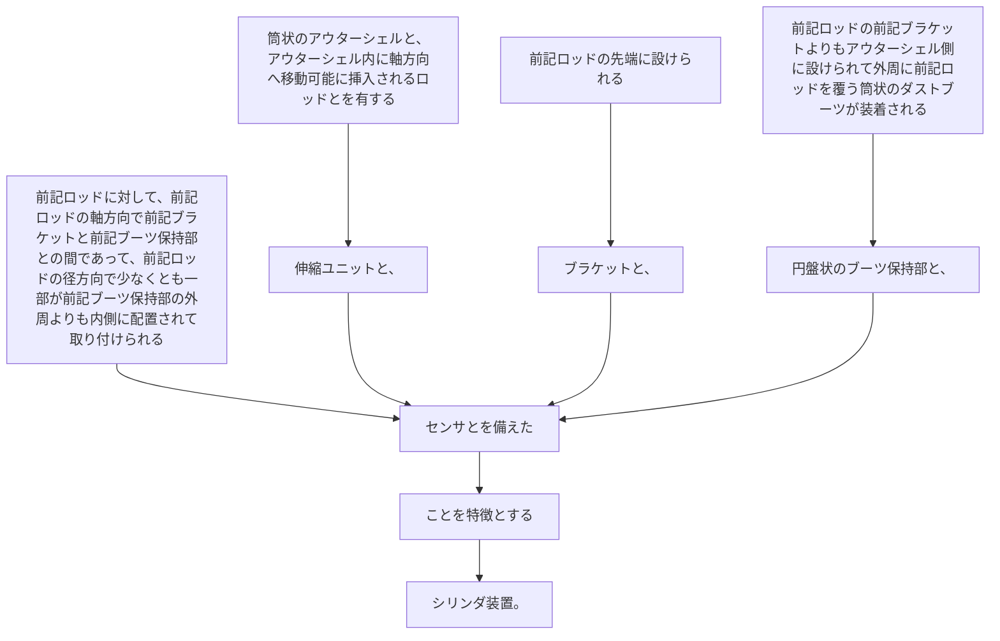

```mermaid
flowchart TD
A[筒状のアウターシェルと、アウターシェル内に軸方向へ移動可能に挿入されるロッドとを有する]
B[伸縮ユニットと、]
C[前記ロッドの先端に設けられる]
D[ブラケットと、]
E[前記ロッドの前記ブラケットよりもアウターシェル側に設けられて外周に前記ロッドを覆う筒状のダストブーツが装着される]
F[円盤状のブーツ保持部と、]
G[前記ロッドに対して、前記ロッドの軸方向で前記ブラケットと前記ブーツ保持部との間であって、前記ロッドの径方向で少なくとも一部が前記ブーツ保持部の外周よりも内側に配置されて取り付けられる]
H[センサとを備えた]
I[ことを特徴とする]
J[シリンダ装置。]
A --> B
C --> D
E --> F
G --> H
B --> H
D --> H
F --> H
H --> I
I --> J
```