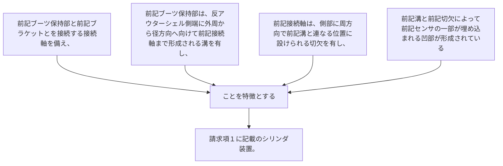

前記ブーツ保持部と前記ブラケットとを接続する接続軸を備え、
前記ブーツ保持部は、反アウターシェル側端に外周から径方向へ向けて前記接続軸まで形成される溝を有し、
前記接続軸は、側部に周方向で前記溝と連なる位置に設けられる切欠を有し、
前記溝と前記切欠によって前記センサの一部が埋め込まれる凹部が形成されている
ことを特徴とする請求項１に記載のシリンダ装置。

```mermaid
flowchart TD
A[前記ブーツ保持部と前記ブラケットとを接続する接続軸を備え、]
B[前記ブーツ保持部は、反アウターシェル側端に外周から径方向へ向けて前記接続軸まで形成される溝を有し、]
C[前記接続軸は、側部に周方向で前記溝と連なる位置に設けられる切欠を有し、]
D[前記溝と前記切欠によって前記センサの一部が埋め込まれる凹部が形成されている]
E[ことを特徴とする]
F[請求項１に記載のシリンダ装置。]
A --> E
B --> E
C --> E
D --> E
E --> F
```