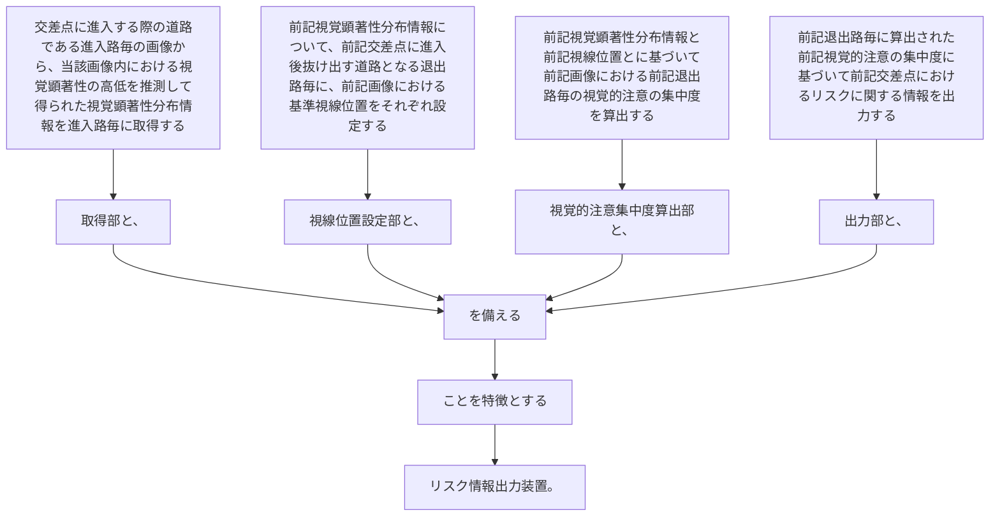

交差点に進入する際の道路である進入路毎の画像から、当該画像内における視覚顕著性の高低を推測して得られた視覚顕著性分布情報を進入路毎に取得する取得部と、
前記視覚顕著性分布情報について、前記交差点に進入後抜け出す道路となる退出路毎に、前記画像における基準視線位置をそれぞれ設定する視線位置設定部と、
前記視覚顕著性分布情報と前記視線位置とに基づいて前記画像における前記退出路毎の視覚的注意の集中度を算出する視覚的注意集中度算出部と、
前記退出路毎に算出された前記視覚的注意の集中度に基づいて前記交差点におけるリスクに関する情報を出力する出力部と、
を備えることを特徴とするリスク情報出力装置。
