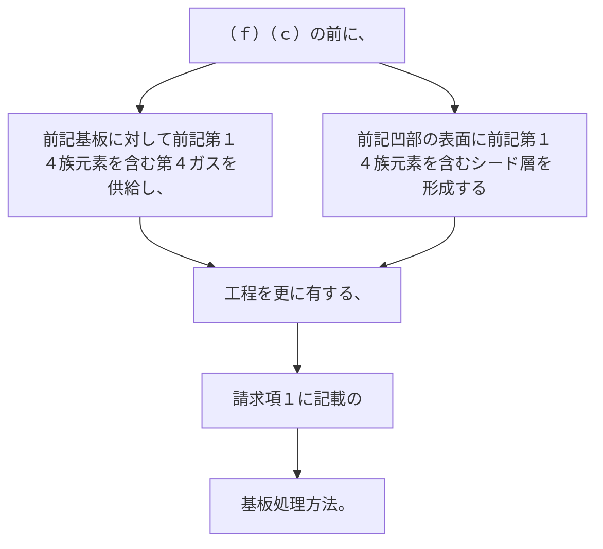

（ｆ）（ｃ）の前に、前記基板に対して前記第１４族元素を含む第４ガスを供給し、前記凹部の表面に前記第１４族元素を含むシード層を形成する工程を更に有する、
請求項１に記載の基板処理方法。

```mermaid
flowchart TD
A[（ｆ）（ｃ）の前に、]
B[前記基板に対して前記第１４族元素を含む第４ガスを供給し、]
C[前記凹部の表面に前記第１４族元素を含むシード層を形成する]
D[工程を更に有する、]
E[請求項１に記載の]
F[基板処理方法。]
A --> B
A --> C
B --> D
C --> D
D --> E
E --> F
```