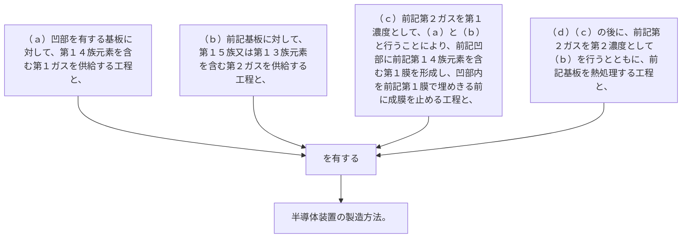

（ａ）凹部を有する基板に対して、第１４族元素を含む第１ガスを供給する工程と、
（ｂ）前記基板に対して、第１５族又は第１３族元素を含む第２ガスを供給する工程と、
（ｃ）前記第２ガスを第１濃度として、（ａ）と（ｂ）と行うことにより、前記凹部に前記第１４族元素を含む第１膜を形成し、凹部内を前記第１膜で埋めきる前に成膜を止める工程と、
（ｄ）（ｃ）の後に、前記第２ガスを第２濃度として（ｂ）を行うとともに、前記基板を熱処理する工程と、
を有する半導体装置の製造方法。
