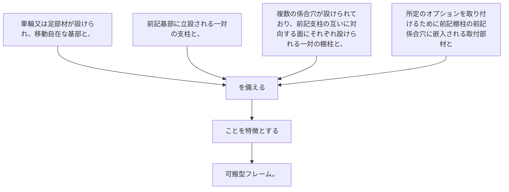

```mermaid
flowchart TD
A[車輪又は足部材が設けられ、移動自在な基部と、]
B[前記基部に立設される一対の支柱と、]
C[複数の係合穴が設けられており、前記支柱の互いに対向する面にそれぞれ設けられる一対の棚柱と、]
D[所定のオプションを取り付けるために前記棚柱の前記係合穴に嵌入される取付部材と]
E[を備える]
F[ことを特徴とする]
G[可搬型フレーム。]
A --> E
B --> E
C --> E
D --> E
E --> F
F --> G
```