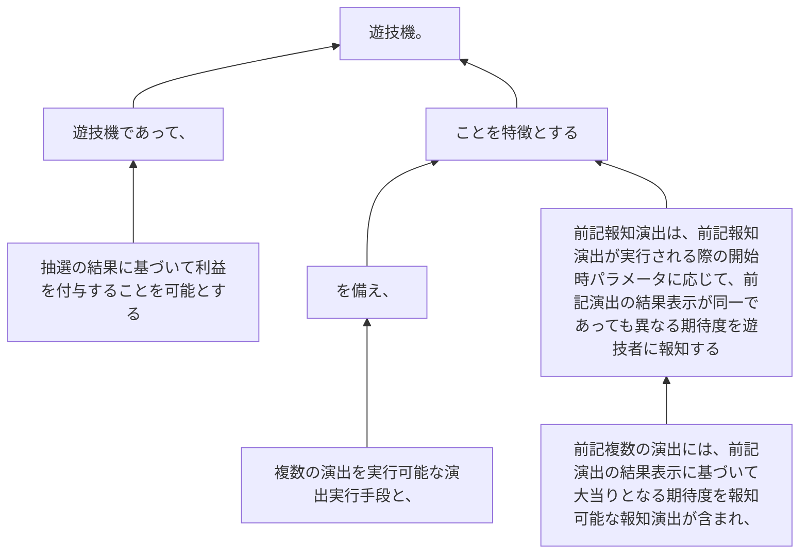

抽選の結果に基づいて利益を付与することを可能とする遊技機であって、
複数の演出を実行可能な演出実行手段と、
を備え、
前記複数の演出には、前記演出の結果表示に基づいて大当りとなる期待度を報知可能な報知演出が含まれ、
前記報知演出は、前記報知演出が実行される際の開始時パラメータに応じて、前記演出の結果表示が同一であっても異なる期待度を遊技者に報知することを特徴とする遊技機。

```mermaid
flowchart BT
A["抽選の結果に基づいて利益を付与することを可能とする"]
B["遊技機であって、"]
C["複数の演出を実行可能な演出実行手段と、"]
D["を備え、"]
E["前記複数の演出には、前記演出の結果表示に基づいて大当りとなる期待度を報知可能な報知演出が含まれ、"]
F["前記報知演出は、前記報知演出が実行される際の開始時パラメータに応じて、前記演出の結果表示が同一であっても異なる期待度を遊技者に報知する"]
G["ことを特徴とする"]
H["遊技機。"]

A --> B
C --> D
E --> F
D --> G
F --> G
B --> H
G --> H
```