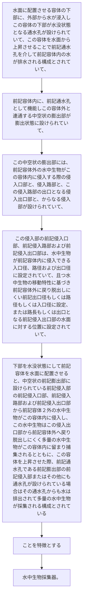

```mermaid
flowchart TD
A[水面に配置させる容体の下部に、外部から水が浸入しこの容体の下部が水没状態となる通水孔が設けられていて、この容体を水面から上昇させることで前記通水孔を介して前記容体内の水が排水される構成とされていて、]
B[前記容体内に、前記通水孔として機能しこの容体外と連通する中空状の膨出部が膨出状態に設けられていて、]
C[この中空状の膨出部には、前記容体外の水中生物がこの容体内に侵入する際の侵入口部と、侵入路部と、この侵入路部の出口となる侵入出口部と、からなる侵入部が設けられていて、]
D[この侵入部の前記侵入口部、前記侵入路部および前記侵入出口部は、水中生物が前記容体内に侵入できる入口径、路径および出口径に設定されていて、且つ水中生物の移動特性に基づき前記容体外に戻り脱出しにくい前記出口径もしくは路径もしくは入口径に設定、または路長もしくは出口となる前記侵入出口部の水面に対する位置に設定されていて、]
E[下部を水没状態にして前記容体を水面に配置させると、中空状の前記膨出部に設けられている前記侵入部の前記侵入口部、前記侵入路部および前記侵入出口部から前記容体２外の水中生物がこの容体内に侵入し、この水中生物はこの侵入出口部から前記容体外へ戻り脱出しにくく多量の水中生物がこの容体内に留まり捕集されるとともに、この容体を上昇させた際、前記通水孔である前記膨出部の前記侵入部またはその他にも通水孔が設けられている場合はその通水孔からも水は排出されて多量の水中生物が採集される構成とされている]
F[ことを特徴とする]
G[水中生物採集器。]
A --> B
B --> C
C --> D
D --> E
E --> F
F --> G
```