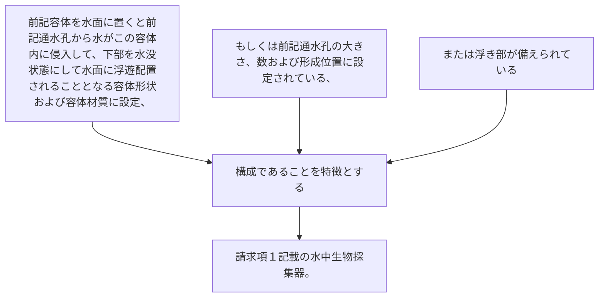

前記容体を水面に置くと前記通水孔から水がこの容体内に侵入して、下部を水没状態にして水面に浮遊配置されることとなる容体形状および容体材質に設定、もしくは前記通水孔の大きさ、数および形成位置に設定されている、または浮き部が備えられている構成であることを特徴とする請求項１記載の水中生物採集器。

```mermaid
flowchart TD
A[前記容体を水面に置くと前記通水孔から水がこの容体内に侵入して、下部を水没状態にして水面に浮遊配置されることとなる容体形状および容体材質に設定、]
B[もしくは前記通水孔の大きさ、数および形成位置に設定されている、]
C[または浮き部が備えられている]
D[構成であることを特徴とする]
E[請求項１記載の水中生物採集器。]
A --> D
B --> D
C --> D
D --> E
```