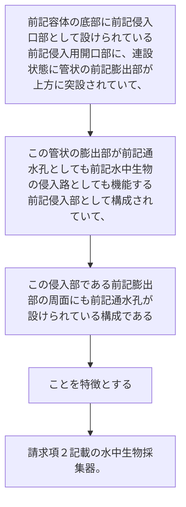

前記容体の底部に前記侵入口部として設けられている前記侵入用開口部に、連設状態に管状の前記膨出部が上方に突設されていて、この管状の膨出部が前記通水孔としても前記水中生物の侵入路としても機能する前記侵入部として構成されていて、この侵入部である前記膨出部の周面にも前記通水孔が設けられている構成であることを特徴とする請求項２記載の水中生物採集器。

```mermaid
flowchart TD
A[前記容体の底部に前記侵入口部として設けられている前記侵入用開口部に、連設状態に管状の前記膨出部が上方に突設されていて、]
B[この管状の膨出部が前記通水孔としても前記水中生物の侵入路としても機能する前記侵入部として構成されていて、]
C[この侵入部である前記膨出部の周面にも前記通水孔が設けられている構成である]
D[ことを特徴とする]
E[請求項２記載の水中生物採集器。]
A --> B
B --> C
C --> D
D --> E
```