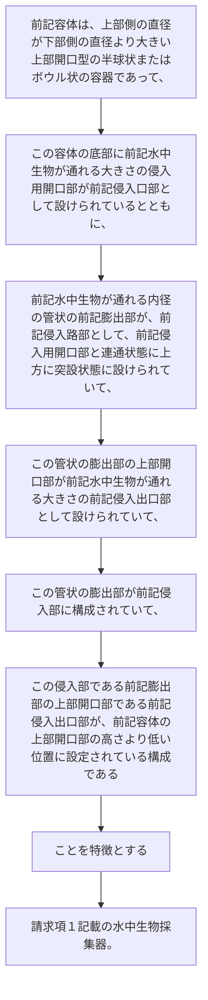

```mermaid
flowchart TD
A[前記容体は、上部側の直径が下部側の直径より大きい上部開口型の半球状またはボウル状の容器であって、]
B[この容体の底部に前記水中生物が通れる大きさの侵入用開口部が前記侵入口部として設けられているとともに、]
C[前記水中生物が通れる内径の管状の前記膨出部が、前記侵入路部として、前記侵入用開口部と連通状態に上方に突設状態に設けられていて、]
D[この管状の膨出部の上部開口部が前記水中生物が通れる大きさの前記侵入出口部として設けられていて、]
E[この管状の膨出部が前記侵入部に構成されていて、]
F[この侵入部である前記膨出部の上部開口部である前記侵入出口部が、前記容体の上部開口部の高さより低い位置に設定されている構成である]
G[ことを特徴とする]
H[請求項１記載の水中生物採集器。]
A --> B
B --> C
C --> D
D --> E
E --> F
F --> G
G --> H
```