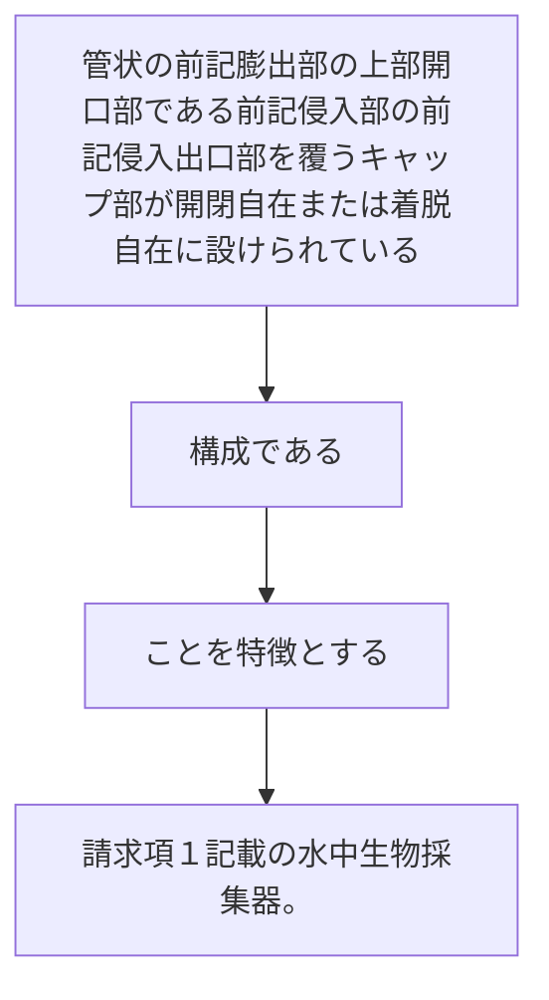

管状の前記膨出部の上部開口部である前記侵入部の前記侵入出口部を覆うキャップ部が開閉自在または着脱自在に設けられている構成であることを特徴とする請求項１記載の水中生物採集器。

```mermaid
flowchart TD
A[管状の前記膨出部の上部開口部である前記侵入部の前記侵入出口部を覆うキャップ部が開閉自在または着脱自在に設けられている]
B[構成である]
C[ことを特徴とする]
D[請求項１記載の水中生物採集器。]
A --> B
B --> C
C --> D
```