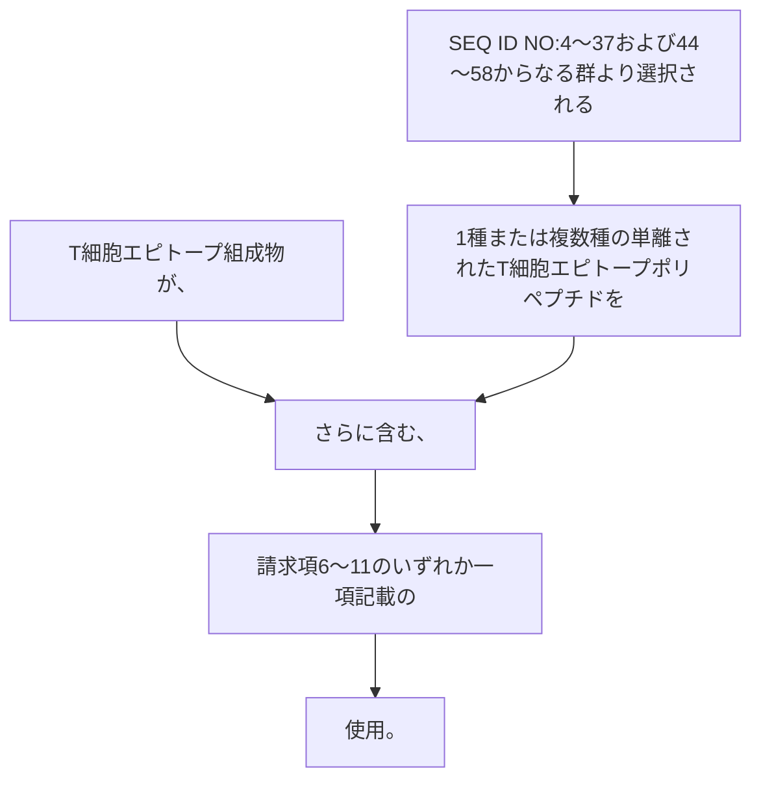

T細胞エピトープ組成物が、SEQ ID NO:4～37および44～58からなる群より選択される1種または複数種の単離されたT細胞エピトープポリペプチドをさらに含む、請求項6～11のいずれか一項記載の使用。

```mermaid
flowchart TD
A[T細胞エピトープ組成物が、]
B[SEQ ID NO:4～37および44～58からなる群より選択される]
C[1種または複数種の単離されたT細胞エピトープポリペプチドを]
D[さらに含む、]
E[請求項6～11のいずれか一項記載の]
F[使用。]
A --> D
B --> C
C --> D
D --> E
E --> F
```